# Jarkom-Modul-4-IT09-2024

| Nama | NRP |
|---------|---------|
| Gavriel Pramuda Kurniaadi | 5027221031  |
| Stephanie Hebrina Mabunbun Simatupang | 5027221069  | 

## Topologi 
### CPT
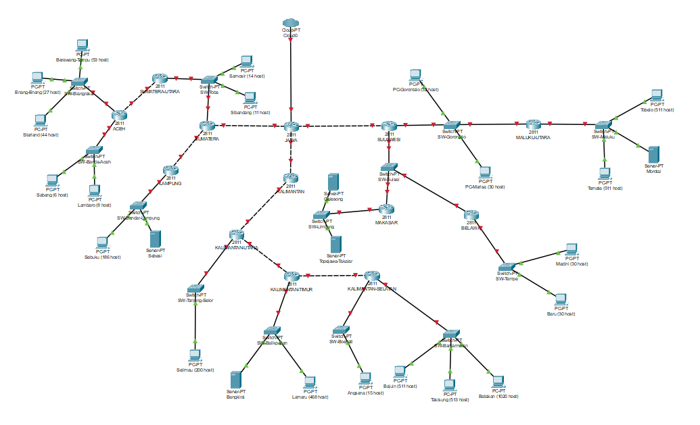

### GNS3
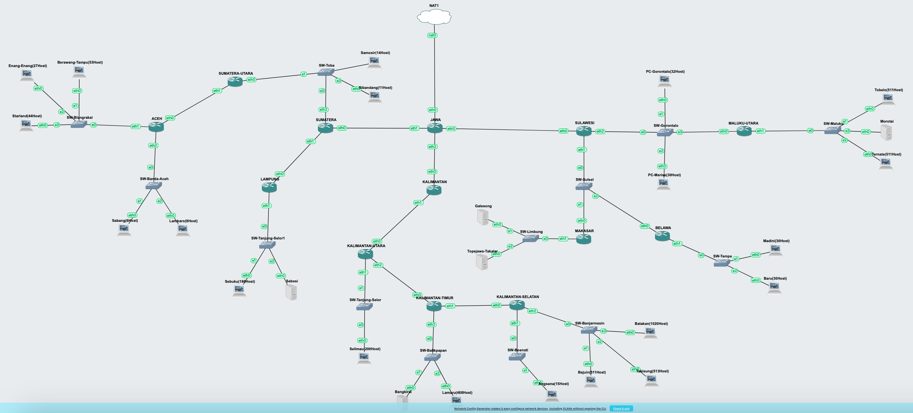

## Prefix IP
Kelompok kami memiliki Prefix IP 10.68

## Rute
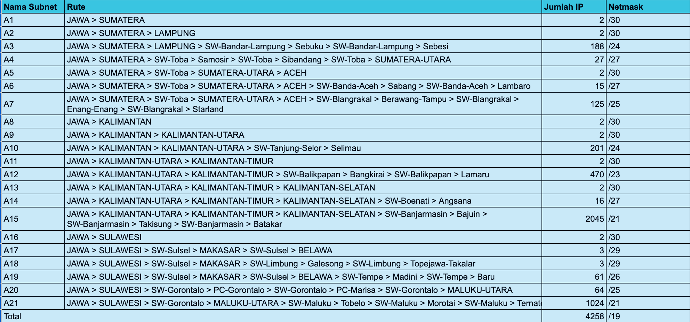

## VLSM 
Inti utama dari penggunaan teknik VLSM adalah untuk mengefisienkan pembagian IP di dalam jaringan. Besar netmask disesuaikan dengan banyaknya komputer/ host yang membutuhkan alamat IP.

Jadi, pada teknik VLSM, subnet mask (netmask) akan diberikan sesuai dengan kebutuhan jumlah alamat IP dari subnet tersebut.

**Tree VLSM :**
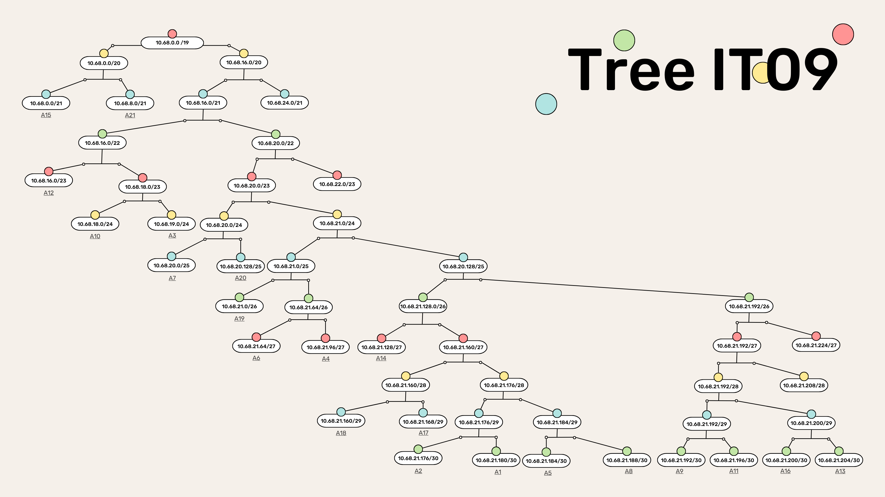

**Pembagian IP :**


**Konfigurasi Network :**
- JAWA
```
auto lo
iface lo inet loopback

auto eth0
iface eth0 inet dhcp

auto eth1
iface eth1 inet static
    address 10.68.21.177
    netmask 255.255.255.252

auto eth2
iface eth2 inet static
    address 10.68.21.189
    netmask 255.255.255.252

auto eth3
iface eth3 inet static
    address 10.68.21.205
    netmask 255.255.255.252
```
- SUMATERA 
```
auto lo
iface lo inet loopback

auto eth0
iface eth0 inet static
    address 10.68.21.178
    netmask 255.255.255.252
    gateway 10.68.21.177

auto eth1
iface eth1 inet static
    address 10.68.21.181
    netmask 255.255.255.252

auto eth2
iface eth2 inet static
    address 10.68.21.65
    netmask 255.255.255.224
```
- LAMPUNG 
```
auto lo
iface lo inet loopback

auto eth0
iface eth0 inet static
    address 10.68.21.182
    netmask 255.255.255.252
    gateway 10.68.21.181

auto eth1
iface eth1 inet static
    address 10.68.19.1
    netmask 255.255.255.0

```
- Sebuku 
```
auto eth0
iface eth0 inet static
    address 10.68.19.2
    netmask 255.255.255.0
    gateway 10.68.19.1
```
- Sebesi 
```
auto eth0
iface eth0 inet static
    address 10.68.19.3
    netmask 255.255.255.0
    gateway 10.68.19.1
```
- Sibandang 
```
auto eth0
iface eth0 inet static
    address 10.68.21.66
    netmask 255.255.255.224
    gateway 10.68.21.65
```
- Samosir 
```
auto eth0
iface eth0 inet static
    address 10.68.21.67
    netmask 255.255.255.224
    gateway 10.68.21.65
```
- SUMATERA-UTARA 
```
auto lo
iface lo inet loopback

auto eth0
iface eth0 inet static
    address 10.68.21.68
    netmask 255.255.255.224
    gateway 10.68.21.65

auto eth1
iface eth1 inet static
    address 10.68.21.185
    netmask 255.255.255.252
```
- ACEH 
```
auto lo
iface lo inet loopback

auto eth0
iface eth0 inet static
    address 10.68.21.186
    netmask 255.255.255.252
    gateway 10.68.21.185

auto eth1
iface eth1 inet static
    address 10.68.20.1
    netmask 255.255.255.128

auto eth2
iface eth2 inet static
    address 10.68.21.129
```
- Berawang-Tampu 
```
auto eth0
iface eth0 inet static
    address 10.68.20.2
    netmask 255.255.255.128
    gateway 10.68.20.1
```
- Enang-Enang 
```
auto eth0
iface eth0 inet static
    address 10.68.20.3
    netmask 255.255.255.128
    gateway 10.68.20.1
```
- Starland 
```
auto eth0
iface eth0 inet static
    address 10.68.20.4
    netmask 255.255.255.128
    gateway 10.68.20.1
```
- Sabang 
```
auto eth0
iface eth0 inet static
    address 10.68.21.130
    netmask 255.255.255.224
    gateway 10.68.21.129
```
- Lambaro 
```
auto eth0
iface eth0 inet static
    address 10.68.21.131
    netmask 255.255.255.224
    gateway 10.68.21.129
```
- KALIMANTAN 
```
auto lo
iface lo inet loopback

auto eth0
iface eth0 inet static
    address 10.68.21.190
    netmask 255.255.255.252
    gateway 10.68.21.189

auto eth1
iface eth1 inet static
    address 10.68.21.193
    netmask 255.255.255.252
```
- KALIMANTAN-UTARA 
```
auto lo
iface lo inet loopback

auto eth0
iface eth0 inet static
    address 10.68.21.194
    netmask 255.255.255.252
    gateway 10.68.21.193

auto eth1
iface eth1 inet static
    address 10.68.18.1
    netmask 255.255.255.0

auto eth2
iface eth2 inet static
    address 10.68.21.197
    netmask 255.255.255.252
```
- Selimau 
```
auto eth0
iface eth0 inet static
    address 10.68.18.2
    netmask 255.255.255.0
    gateway 10.68.18.1
```
- KALIMANTAN-TIMUR 
```
auto lo
iface lo inet loopback

auto eth0
iface eth0 inet static
    address 10.68.21.198
    netmask 255.255.255.252
    gateway 10.68.21.197

auto eth1
iface eth1 inet static
    address 10.68.16.1
    netmask 255.255.254.0

auto eth2
iface eth2 inet static
    address 10.68.21.201
    netmask 255.255.255.252
```
- Bangkirai 
```
auto eth0
iface eth0 inet static
    address 10.68.16.2
    netmask 255.255.254.0
    gateway 10.68.16.1
```
- Lamaru 
```
auto eth0
iface eth0 inet static
    address 10.68.16.3
    netmask 255.255.254.0
    gateway 10.68.16.1
```
- KALIMANTAN-SELATAN 
```
auto lo
iface lo inet loopback

auto eth0
iface eth0 inet static
    address 10.68.21.202
    netmask 255.255.255.252
    gateway 10.68.21.201

auto eth1
iface eth1 inet static
    address 10.68.21.97
    netmask 255.255.255.224

auto eth2
iface eth2 inet static
    address 10.68.0.1
    netmask 255.255.248.0
```
- Angsana 
```
auto eth0
iface eth0 inet static
    address 10.68.21.98
    netmask 255.255.255.224
    gateway 10.68.21.97
```
- Bajuin 
```
auto eth0
iface eth0 inet static
    address 10.68.0.2
    netmask 255.255.248.0
    gateway 10.68.0.1
```
- Takisung 
```
auto eth0
iface eth0 inet static
    address 10.68.0.3
    netmask 255.255.248.0
    gateway 10.68.0.1
```
- Batakan 
```
auto eth0
iface eth0 inet static
    address 10.68.0.4
    netmask 255.255.248.0
    gateway 10.68.0.1
```
- SULAWESI 
```
auto lo
iface lo inet loopback

auto eth0
iface eth0 inet static
    address 10.68.21.206
    netmask 255.255.255.252
    gateway 10.68.21.205

auto eth1
iface eth1 inet static
    address 10.68.21.161
    netmask 255.255.255.248

auto eth2
iface eth2 inet static
    address 10.68.20.129
    netmask 255.255.255.128
```
- MAKASAR 
```
auto lo
iface lo inet loopback

auto eth0
iface eth0 inet static
    address 10.68.21.162
    netmask 255.255.255.248
    gateway 10.68.21.161

auto eth1
iface eth1 inet static
    address 10.68.21.169
    netmask 255.255.255.248
```
- Topejawa-Takalar 
```
auto eth0
iface eth0 inet static
    address 10.68.21.170
    netmask 255.255.255.248
    gateway 10.68.21.169
```
- Galesong 
```
auto eth0
iface eth0 inet static
    address 10.68.21.170
    netmask 255.255.255.248
    gateway 10.68.21.169
```
- BELAWA 
```
auto lo
iface lo inet loopback

auto eth0
iface eth0 inet static
    address 10.68.21.163
    netmask 255.255.255.248
    gateway 10.68.21.161

auto eth1
iface eth1 inet static
    address 10.68.21.1
    netmask 255.255.255.192
```
- Baru 
```
auto eth0
iface eth0 inet static
    address 10.68.21.2
    netmask 255.255.255.192
    gateway 10.68.21.1
```
- Madini 
```
auto eth0
iface eth0 inet static
    address 10.68.21.3
    netmask 255.255.255.192
    gateway 10.68.21.1
```
- Marisa 
```
auto eth0
iface eth0 inet static
    address 10.68.20.132
    netmask 255.255.255.128
    gateway 10.68.20.129
```
- Gorontalo 
```
auto eth0
iface eth0 inet static
    address 10.68.20.131
    netmask 255.255.255.128
    gateway 10.68.20.129
```
- MALUKU-UTARA 
```
auto lo
iface lo inet loopback

auto eth0
iface eth0 inet static
    address 10.68.20.130
    netmask 255.255.255.128
    gateway 10.68.20.129

auto eth1
iface eth1 inet static
    address 10.68.8.1
    netmask 255.255.248.0
``` 
- Ternate 
```
auto eth0
iface eth0 inet static
    address 10.68.8.2
    netmask 255.255.248.0
    gateway 10.68.8.1
```
- Morotai 
```
auto eth0
iface eth0 inet static
    address 10.68.8.3
    netmask 255.255.248.0
    gateway 10.68.8.1
```
- Tobelo 
```
auto eth0
iface eth0 inet static
    address 10.68.8.4
    netmask 255.255.248.0
    gateway 10.68.8.1
```

## Routing 
- Jawa
```
#SUMATERA
route add -net 10.68.21.180 netmask 255.255.255.252 gw 10.68.21.178
route add -net 10.68.19.0 netmask 255.255.255.0 gw 10.68.21.178
route add -net 10.68.21.64 netmask 255.255.255.224 gw 10.68.21.178
route add -net 10.68.21.184 netmask 255.255.255.252 gw 10.68.21.178
route add -net 10.68.20.0 netmask 255.255.255.128 gw 10.68.21.178
route add -net 10.68.21.128 netmask 255.255.255.224 gw 10.68.21.178

#KALIMANTAN
route add -net 10.68.21.192 netmask 255.255.255.252 gw 10.68.21.190
route add -net 10.68.18.0 netmask 255.255.255.0 gw 10.68.21.190
route add -net 10.68.21.196 netmask 255.255.255.252 gw 10.68.21.190
route add -net 10.68.16.0 netmask 255.255.254.0 gw 10.68.21.190
route add -net 10.68.21.200 netmask 255.255.255.252 gw 10.68.21.190
route add -net 10.68.21.96 netmask 255.255.255.224 gw 10.68.21.190
route add -net 10.68.0.0 netmask 255.255.248.0 gw 10.68.21.190

#SULAWESI
route add -net 10.68.21.160 netmask 255.255.255.248 gw 10.68.21.206
route add -net 10.68.21.168 netmask 255.255.255.248 gw 10.68.21.206
route add -net 10.68.21.0 netmask 255.255.255.192 gw 10.68.21.206
route add -net 10.68.20.128 netmask 255.255.255.128 gw 10.68.21.206
route add -net 10.68.8.0 netmask 255.255.248.0 gw 10.68.21.206
```
- SUMATERA
```
#JAWA
route add -net 0.0.0.0 netmask 0.0.0.0 gw 10.68.21.177

#SUMATERA-UTARA
route add -net 10.68.21.184 netmask 255.255.255.252 gw 10.68.21.68
route add -net 10.68.20.0 netmask 255.255.255.128 gw 10.68.21.68
route add -net 10.68.21.128 netmask 255.255.255.224 gw 10.68.21.68

#LAMPUNG
route add -net 10.68.19.0 netmask 255.255.255.0 gw 10.68.21.182
```
- KALIMANTAN
```
route add -net 10.68.18.0 netmask 255.255.255.0 gw 10.68.21.194
route add -net 10.68.21.196 netmask 255.255.255.252 gw 10.68.21.194
route add -net 10.68.16.0 netmask 255.255.254.0 gw 10.68.21.194
route add -net 10.68.21.200 netmask 255.255.255.252 gw 10.68.21.194
route add -net 10.68.21.96 netmask 255.255.255.224 gw 10.68.21.194
route add -net 10.68.0.0 netmask 255.255.248.0 gw 10.68.21.194
```
- SULAWESI
```
#MALUKU-UTARA
route add -net 10.68.8.0 netmask 255.255.248.0 gw 10.68.20.130

#MAKASAR
route add -net 10.68.21.168 netmask 255.255.255.248 gw 10.68.21.162

#BELAWA
route add -net 10.68.21.0 netmask 255.255.255.192 gw 10.68.21.163
```
- SUMATERA-UTARA
```
#SW-BLANGKARAI
route add -net 10.68.20.0 netmask 255.255.255.128 gw 10.68.21.186
#SW-BANDA-ACEH
route add -net 10.68.21.128 netmask 255.255.255.224 gw 10.68.21.186 
```
- LAMPUNG
```
#SUMATERA
route add -net 0.0.0.0 netmask 0.0.0.0 gw 10.68.21.181
```
- KALIMANTAN-UTARA
```
route add -net 10.68.16.0 netmask 255.255.254.0 gw 10.68.21.198
route add -net 10.68.21.200 netmask 255.255.255.252 gw 10.68.21.198
route add -net 10.68.21.96 netmask 255.255.255.224 gw 10.68.21.198
route add -net 10.68.0.0 netmask 255.255.248.0 gw 10.68.21.198
```
- MAKASAR
```
#SULAWESI
route add -net 0.0.0.0 netmask 0.0.0.0 gw 10.68.21.161
```
- BELAWA 
```
#SULAWESI
route add -net 0.0.0.0 netmask 0.0.0.0 gw 10.68.21.161
```
- MALUKU-UTARA
```
#SULAWESI
route add -net 0.0.0.0 netmask 0.0.0.0 gw 10.68.20.129
```
- ACEH
```
#SUMATERA UTARA
route add -net 0.0.0.0 netmask 0.0.0.0 gw 10.68.21.185 
```
- KALIMANTAN-TIMUR
```
route add -net 10.68.21.96 netmask 255.255.255.224 gw 10.68.21.202
route add -net 10.68.0.0 netmask 255.255.248.0 gw 10.68.21.202
```
- KALIMANTAN-SELATAN
```
#KALIMANTAN-TIMUR
route add -net 0.0.0.0 netmask 0.0.0.0 gw 10.68.21.201
```

## Testing : 
<video controls src="assets/0608.mp4" title="demo"></video>


## CIDR (CPT)

### Penggabungan
1. Pertama

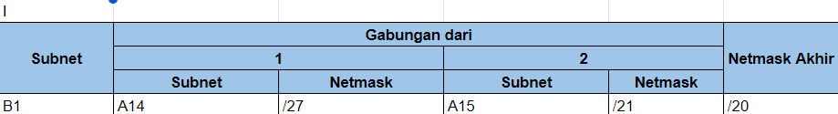

2. Kedua

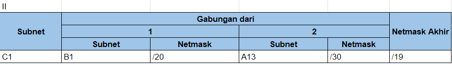

3. Ketiga

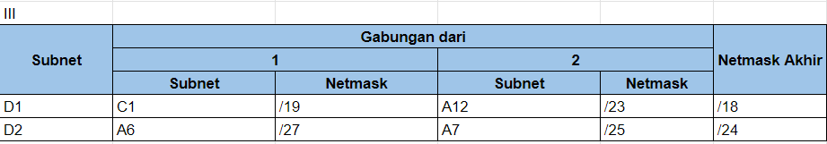

4. Keempat

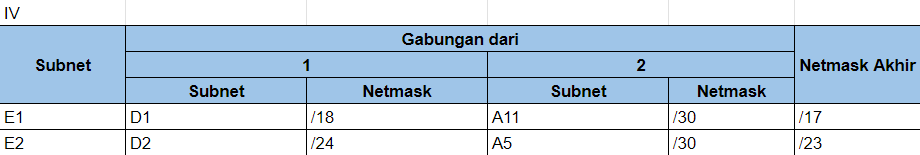

5. Kelima

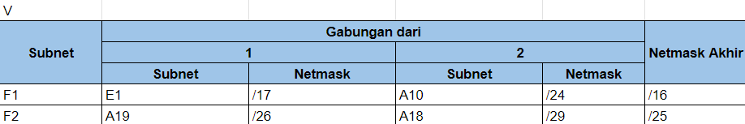

6. Keenam

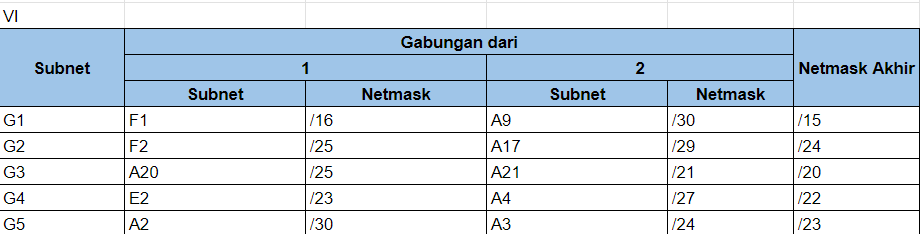

7. Ketujuh

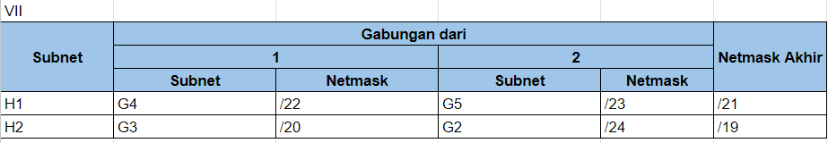

8. Kedelapan

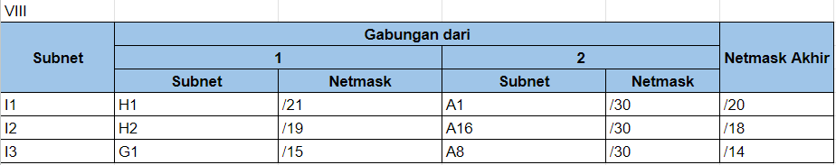

9. Kesembilan

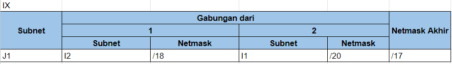

10. Kesepuluh

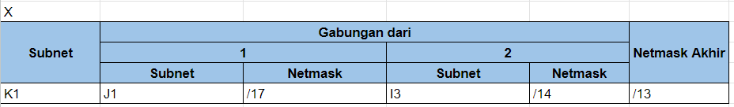

### Tree
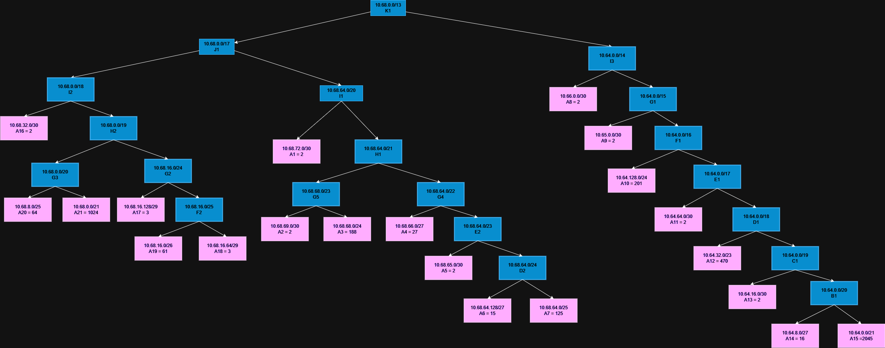

### Pembagian IP
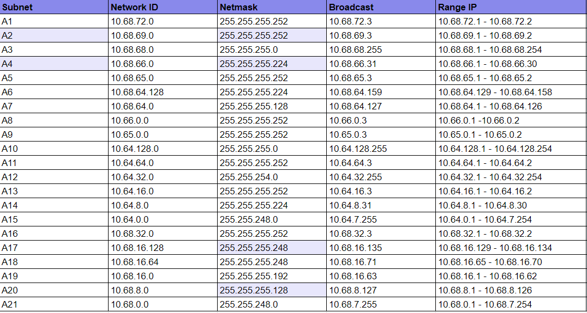

### Testing
<video controls src="assets/demo-cidr.mp4" title="demo"></video>