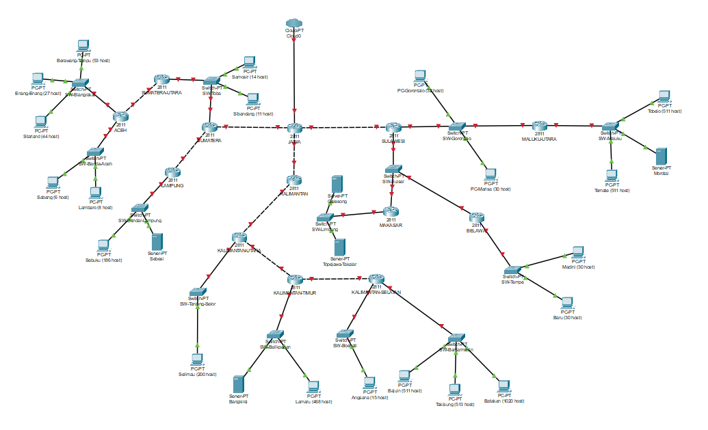
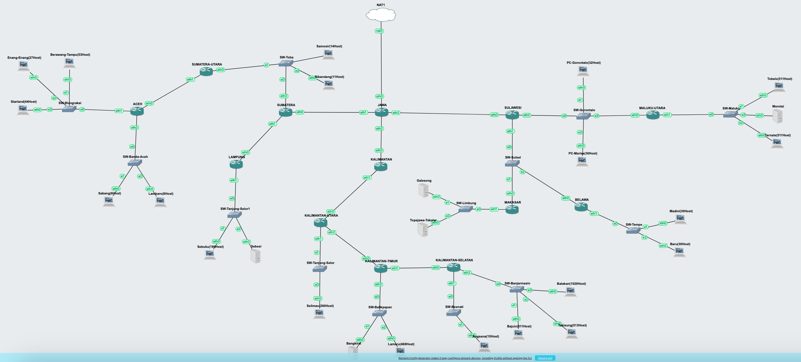
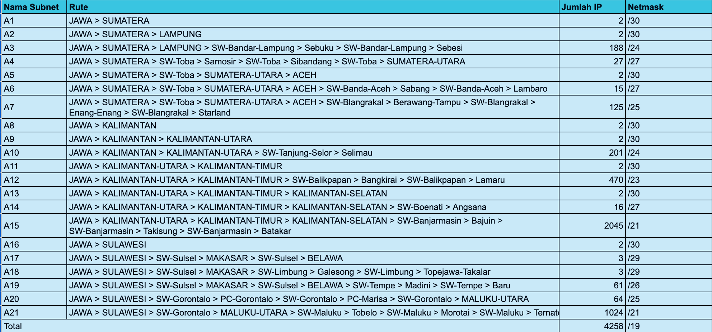
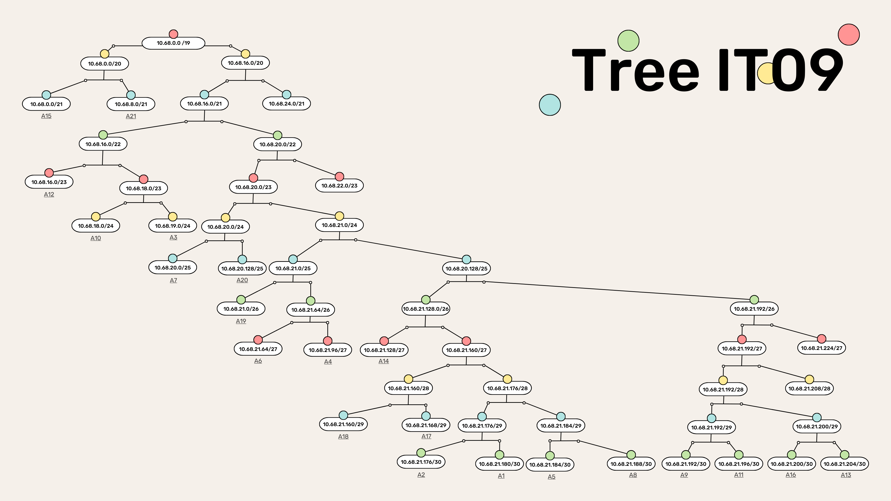

# Jarkom-Modul-4-IT09-2024

| Nama | NRP |
|---------|---------|
| Gavriel Pramuda Kurniaadi | 5027221031  |
| Stephanie Hebrina Mabunbun Simatupang | 5027221069  | 

## Topologi 
### CPT


### GNS3


## Prefix IP
Kelompok kami memiliki Prefix IP 10.68

## Rute


## VLSM 
Inti utama dari penggunaan teknik VLSM adalah untuk mengefisienkan pembagian IP di dalam jaringan. Besar netmask disesuaikan dengan banyaknya komputer/ host yang membutuhkan alamat IP.

Jadi, pada teknik VLSM, subnet mask (netmask) akan diberikan sesuai dengan kebutuhan jumlah alamat IP dari subnet tersebut.

**Tree VLSM :**


**Pembagian IP :**


**Konfigurasi Network :**
- Jawa
```
auto lo
iface lo inet loopback

auto eth0
iface eth0 inet dhcp

#A1 Jawa Sumatera
auto eth1
iface eth1 inet static
address 10.68.21.181
netmask 255.255.255.252

#A8 Jawa Kalimantan
auto eth2
iface eth2 inet static
address 10.68.21.189
netmask 255.255.255.252

#A16 jAWA SumatrA
auto eth3
iface eth3 inet static
address 10.68.21.201
netmask 255.255.255.252
```

- Sumatera 
```
auto lo
iface lo inet loopback

#A1 Jawa Sumatera
auto eth0
iface eth0 inet static
address 10.68.21.182
netmask 255.255.255.252
gateway 10.68.21.181

#A2 sumatra lampung
auto eth1
iface eth1 inet static
address 10.68.21.177
netmask 255.255.255.252

#A4 sumat samosir subandang sumut
auto eth2
iface eth2 inet static
address 10.68.21.97
netmask 255.255.255.224
```

- Samosir(14 Host)
```
auto eth0
iface eth0 inet static
address 10.68.21.125
netmask 255.255.255.224
gateway 10.68.21.97
```

- Sibandang(11 Host)
```
auto eth0
iface eth0 inet static
address 10.68.21.126
netmask 255.255.255.224
gateway 10.68.21.97
```

- Sumatera Utara
```
#A5
auto eth1
iface eth1 inet static
address 10.68.21.185
netmask 255.255.255.252
```

- Aceh
```
#A5
auto eth0
iface eth0 inet static
address 10.68.21.186
netmask 255.255.255.252
gateway 10.68.21.185

#A6
auto eth1
iface eth1 inet static
address 10.68.21.65
netmask 255.255.255.224

#A7
auto eth2
iface eth2 inet static
address 10.68.20.1
netmask 255.255.255.128
```

- Berawang-Tampu(53 Host)
```
#A6
auto eth0
iface eth0 inet static
address 10.68.21.93
netmask 255.255.255.224
gateway 10.68.21.65
```

- Enang-Enang(27 Host)
```
#A6
auto eth0
iface eth0 inet static
address 10.68.21.94
netmask 255.255.255.224
gateway 10.68.21.65
```

- Starland(44 Host)
```
#A6
auto eth0
iface eth0 inet static
address 10.68.21.92
netmask 255.255.255.224
gateway 10.68.21.65
```

- Sabang(6 Host)
```
#A7
auto eth0
iface eth0 inet static
address 10.68.20.126
netmask 255.255.255.128
gateway 10.68.20.1
```

- Lambaro(8 Host)
```
#A7
auto eth0
iface eth0 inet static
address 10.68.20.125
netmask 255.255.255.128
gateway 10.68.20.1
```

- Lampung 
```
auto lo
iface lo inet loopback

#A2 sumat lampung
auto eth0
iface eth0 inet static
address 10.68.21.178
netmask 255.255.255.252
gateway 10.68.21.177

#A3 Lampung sebuku sebesi8
auto eth1
iface eth1 inet static
address 10.68.19.0
netmask 255.255.255.0
```

- Sebuku(186 Host)
```
#A3
auto eth0
iface eth0 inet static
address 10.68.19.254
netmask 255.255.255.0
gateway 10.68.19.1
```

- Sebesi
```
#A3
auto eth0
iface eth0 inet static
address 10.68.19.253
netmask 255.255.255.0
gateway 10.68.19.1
```

- Kalimantan
```
#A8 jawa kalimantn
auto eth0
iface eth0 inet static
address 10.68.21.190
netmask 255.255.255.252
gateway 10.68.21.189

#a9 kali kalut
auto eth1
iface eth1 inet static
address 10.68.21.193
netmask 255.255.255.252
```

- Kalimantan Utara
```
#A9 kali kalut
auto eth0
iface eth0 inet static
address 10.68.21.194
netmask 255.255.255.252
gateway 10.68.21.193

#A10
auto eth1
iface eth1 inet static
address 10.68.18.1
netmask 255.255.255.0

#A11 kali kaltim
auto eth2
iface eth2 inet static
address 10.68.21.197
netmask 255.255.255.252
```

- Selimau
```
#A10
auto eth0
iface eth0 inet static
address 10.68.18.254
netmask 255.255.255.0
gateway 10.68.18.1
```

- Kalimantan Timur
```
#A11
auto eth0
iface eth0 inet static
address 10.68.21.198
netmask 255.255.255.252
gateway 10.68.21.197

#A13
auto eth1
iface eth1 inet static
address 10.68.21.205
netmask 255.255.255.252

#A12
auto eth2
iface eth2 inet static
address 10.68.16.1
netmask 255.255.254.0
```

- Bangkirai 
```
#A12
auto eth0
iface eth0 inet static
address 10.68.17.253
netmask 255.255.254.0
gateway 10.68.16.1
```

- Lamaru(468 Host) 
```
#A12
auto eth0
iface eth0 inet static
address 10.68.17.254
netmask 255.255.254.0
gateway 10.68.16.1
```

- Kalimantan Selatan
```
#A13
auto eth0
iface eth0 inet static
address 10.68.21.206
netmask 255.255.255.252
gateway 10.68.21.205

#A14
auto eth1
iface eth1 inet static
address 10.68.21.129
netmask 255.255.255.224

#A15
auto eth2
iface eth2 inet static
address 10.68.0.1
netmask 255.255.248.0
```

- Angsana(15 Host)
```
#A14
auto eth0
iface eth0 inet static
address 10.68.21.158
netmask 255.255.255.224
gateway 10.68.21.129
```

- Batakan(1020 Host)
```
#A15
auto eth0
iface eth0 inet static
address 10.68.7.253
netmask 255.255.248.0
gateway 10.68.0.1
```

- Takisung(513 Host)
```
#A15
auto eth0
iface eth0 inet static
address 10.68.7.254
netmask 255.255.248.0
gateway 10.68.0.1
```

- Bajuin(511 Host)
```
#A15
auto eth0
iface eth0 inet static
address 10.68.7.252
netmask 255.255.248.0
gateway 10.68.0.1
```

- Sulawesi 
```
auto lo
iface lo inet loopback

#A16 jAWA Sulawesi
auto eth0
iface eth0 inet static
address 10.68.21.202
netmask 255.255.255.252
gateway 10.68.21.201

#a17
auto eth1
iface eth1 inet static
address 10.68.21.169
netmask 255.255.255.248

#A20
auto eth2
iface eth2 inet static
address 10.68.20.129
netmask 255.255.255.128
```

- Makassar
```
#A17
auto eth0
iface eth0 inet static
address 10.68.21.174
netmask 255.255.255.248
gateway 10.68.21.169

#A18
auto eth1
iface eth1 inet static
address 10.68.21.161
netmask 255.255.255.248
```

- Galesong
```
#A18
auto eth0
iface eth0 inet static
address 10.68.21.166
netmask 255.255.255.248
gateway 10.68.21.161
```

- Topejawa-Takalar
```
#A18
auto eth0
iface eth0 inet static
address 10.68.21.166
netmask 255.255.255.248
gateway 10.68.21.161
```

- Belawa 
```
#A17
auto eth0
iface eth0 inet static
address 10.68.21.174
netmask 255.255.255.248
gateway 10.68.21.169

#A19
auto eth1
iface eth1 inet static
address 10.68.21.1
netmask 255.255.255.192
```

- Madini(30 Host)
```
#A19
auto eth0
iface eth0 inet static
address 10.68.21.61
netmask 255.255.255.192
gateway 10.68.21.1
```

- Baru(30 Host)
```
#A19
auto eth0
iface eth0 inet static
address 10.68.21.62
netmask 255.255.255.192
gateway 10.68.21.1
```

- PC-Gorontalo(32 Host)
```
#A20
auto eth0
iface eth0 inet static
address 10.68.20.254
netmask 255.255.255.128
gateway 10.68.20.129
```

- PC-Marisa(30 Host)
```
#A20
auto eth0
iface eth0 inet static
address 10.68.20.253
netmask 255.255.255.128
gateway 10.68.20.129
```

- Maluku Utara
```
#A20
auto eth0
iface eth0 inet static
address 10.68.20.254
netmask 255.255.255.128
gateway 10.68.20.129

#A21
auto eth1
iface eth1 inet static
address 10.68.8.1
netmask 255.255.248.0
```

- Tobelo (511 Host)
```
#A21
auto eth0
iface eth0 inet static
address 192.173.15.254
netmask 255.255.248.0
gateway 10.68.8.1
```

- Ternate (511 Host)
```
#A21
auto eth0
iface eth0 inet static
address 192.173.15.253
netmask 255.255.248.0
gateway 10.68.8.1
```


## CIDR (CPT)

### Penggabungan


## GNS3 (VLSM)
